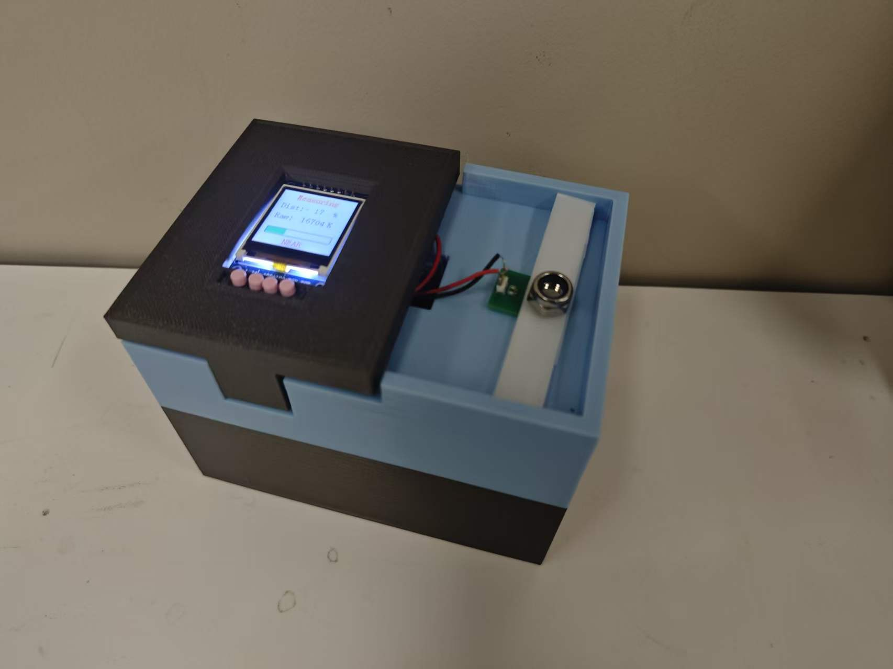

# 基于 LDC1614 的电感式工件合格性检测装置



[English](./README.md) · [演示视频](./media/demonstration.mp4) · [项目汇报](./presentation/project-presentation.pptx) · [项目方案](./docs/project-proposal.docx)

[](https://www.st.com/en/microcontrollers-microprocessors/stm32f103rc.html)
[](https://www.ti.com/product/LDC1614)
[](https://www.iso.org/standard/82075.html)
[](https://www.keil.com/)
[](./LICENSE-CONTENT.md)

一套基于 STM32 的非接触式电感检测原型，用于判断金属工件的位置、装配或紧固状态是否落在合格区间。上图为完成后的实体装置，可见 3D 打印外壳、LCD、操作按键、检测线圈及工件夹具。

## 项目基本信息

| 项目 | 内容 |
|---|---|
| 项目时间 | **2025 年 11 月—2025 年 12 月** |
| 课程 | 电子电路课程项目 |
| 项目组长 | **胡荣杰** |
| 实际开发者 | **胡荣杰——唯一实际设计与开发者** |
| 汇报材料中的名义小组 | 胡荣杰、唐丽莎、张润涵、石周鹭、董佳慧 |
| 贡献说明 | 除胡荣杰外，其余姓名仅出现在课程汇报的成员名单中；电路与系统方案、固件、外壳集成、测试调试及项目文档均由 **胡荣杰一人完成**。 |
| 项目类型 | 嵌入式硬件原型 + 固件 + 3D 打印外壳 |
| 原型成本 | **现有资料未记录，待后续补充** |

## 商业化与应用分析

本项目面向人工目检与高成本机器视觉检测站之间的细分需求。电感探头不依赖环境光，并能在灰尘、油污等场景中检测金属目标，可用于金属件有无、插入深度、螺母紧固位置和夹具定位等判断。

潜在用户包括小型装配车间、教学实验室、工装夹具制造商和小批量生产线。若要产品化，还需增加刚性机械基准、可更换探头夹具、可追溯标定、质量数据记录、EMC 验证以及工业级电源与接口。更合理的商业定位是低成本、专任务检测工装，而非通用精密位移仪。

## 实现原理

检测线圈与电容构成 LC 谐振回路。导电目标靠近后产生涡流，使线圈的等效电感和损耗发生变化；**LDC1614** 将变化转换为高分辨率数字量，**STM32F103RC** 完成滤波、相对位置映射、合格判定和 LCD 显示。

实体原型由购买的电子/机械模块与自制 **3D 打印外壳**组合而成，外壳集成显示区、测试平台、操作按键和内部存放空间。


## 系统总体架构

```text
金属目标
    ↓ 改变线圈电感与谐振响应
LC 检测线圈 → LDC1614 通道 0
                 ↓ 软件 I²C 读取 28 位转换结果
             STM32F103RC
                 ├─ 4 点滑动平均滤波
                 ├─ 两点标定与 0–100% 映射
                 ├─ PASS / FAR / NEAR 判定
                 ├─ LCD 界面与进度条
                 └─ USART 调试输出
```

### 固件分层

| 层级 | 主要路径 | 作用 |
|---|---|---|
| 应用层 | `USER/main.c` | 工作模式、按键事件、标定、滤波、判定、LCD 页面及串口调试 |
| 传感器驱动 | `HARDWARE/LDC1614/` | 软件 I²C、寄存器访问、LDC1614 初始化与通道数据读取 |
| 人机交互 | `HARDWARE/LCD/`、`HARDWARE/KEY/`、`HARDWARE/LED/` | 显示、按键和状态指示 |
| 平台支持 | `SYSTEM/`、`STM32F10x_FWLIB/`、`CORE/` | 时钟、延时、串口、CMSIS、启动文件与 STM32 标准外设库 |

主循环先扫描按键，再读取并滤波 LDC1614 数据。小型状态机在空载标定、合格件标定、等待和测量页面之间切换；只有两个标定位都有效后才执行测量判定。

### 关键固件参数

| 参数 | 当前值 |
|---|---:|
| LDC1614 I²C 地址 | `0x2A` |
| 软件 I²C 引脚 | `PB10` SCL、`PB11` SDA |
| LDC 关断引脚 | `PC13`，驱动中低电平正常工作 |
| 滑动平均窗口 | 4 点 |
| 显示刷新周期 | 150 ms |
| 合格区间 | 45–55% |

### 标定与判定逻辑

1. 记录空载基准；
2. 放置合格参考件并记录第二标定点；
3. 将实时读数映射到 `0–100%` 相对量程；
4. `45–55%` 判为 **PASS**，高于 `55%` 判为 **FAR**，低于 `45%` 判为 **NEAR**。

源码已确认采用上述两点标定与合格区间。早期方案文档曾写 LDC1314，最终硬件和固件实际使用的是 **LDC1614**。


## 设计指标

以下是终期汇报中记录的设计目标，不等同于计量认证结果：

| 指标 | 目标 |
|---|---:|
| 显示刷新 | ≤ 300 ms |
| 相对分辨率 | ≤ 1% |
| 静态波动 | ≤ ±2% |
| 重复误差 | ≤ ±3% |
| 标定流程 | ≤ 5 个操作步骤 |

## 仓库内容

- `USER/Inductive distance measurement.uvprojx`：Keil MDK 工程入口
- `USER/main.c`：应用状态机、滤波、标定、判定和显示逻辑
- `HARDWARE/LDC1614/`：软件 I²C 与 LDC1614 寄存器驱动
- `HARDWARE/LCD/`、`KEY/`、`LED/`：本地人机交互驱动
- `SYSTEM/`、`CORE/`、`STM32F10x_FWLIB/`：STM32 平台支持与库文件
- `assets/`：从终期 PPT 导出的 README 配图
- `docs/project-proposal.docx`：原始项目方案
- `presentation/project-presentation.pptx`：原始终期汇报
- `media/demonstration.mp4`：实体原型演示
- `OBJ/`：历史代码仓库中保留的构建产物

## 下载、编译与使用

### 1. 下载源码

```bash
git clone https://github.com/WuWingKit/LDC1614-Coil-Inspector.git
cd LDC1614-Coil-Inspector
```

没有安装 Git 时，可在仓库页面选择 **Code → Download ZIP**，然后解压。

### 2. 准备环境

- Keil MDK 5，以及与现有工程兼容的 ARM Compiler；
- ST-Link 及其 USB 驱动；
- STM32F103RC 开发板；
- LDC1614 模块和 LC 检测线圈；
- 按固件引脚定义连接的 LCD 与按键。

本项目特意把软件 I²C 设置为 `PB10/PB11`，因为原 `PB8/PB9` 与 LCD 接线冲突。上电前应检查供电电压、共地、SDA/SCL 上拉电阻以及 LDC1614 地址选择。

### 3. 编译与烧录

1. 使用 Keil MDK 打开 `USER/Inductive distance measurement.uvprojx`；
2. 选择工程已有 Target，执行 **Build**（`F7`）；
3. 通过 SWD 连接 ST-Link，执行 **Download**（`F8`）；
4. 如果传感器启动界面显示 `FAIL`，依次检查 I²C 接线、地址选择、关断引脚和共地。

### 4. 标定与检测

1. 测试平台上不放金属件，进入空载标定并确认读数；
2. 将合格参考件放在规定位置，保存第二个标定点；
3. 界面确认两项标定都完成后进入测量模式；
4. 放置待测件，查看相对百分比、原始值、进度条及 `PASS`/`FAR`/`NEAR` 结果。

标定值保存在 RAM 中，系统复位后需要重新采集。遇到读数不稳或判定异常时，可结合串口输出排查。

## 当前限制

- 输出是相对两点标定值，并非毫米级绝对距离；
- 夹具刚度、目标材质和形状、温度与线圈对中均会影响读数；
- 尚未实现长期标定追溯、生产统计或工业 I/O；
- 现有资料没有可核验的物料清单与成本记录。

## 协议

项目原创文档、汇报、图片、视频和硬件设计资料采用 **CC BY-NC-SA 4.0**；详见 [LICENSE-CONTENT.md](./LICENSE-CONTENT.md)。源码及第三方厂商组件仍遵循各自文件中注明的许可条款。
