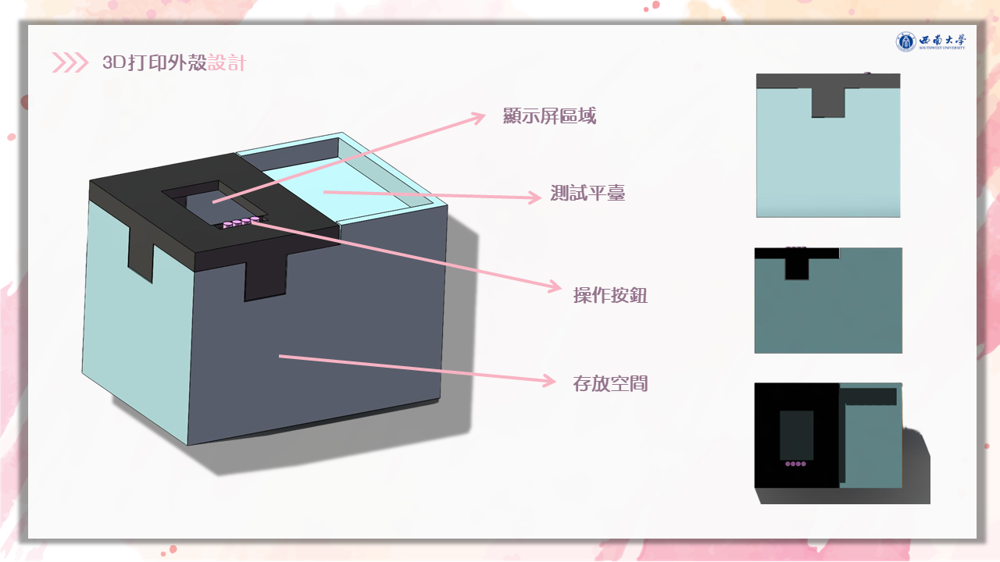
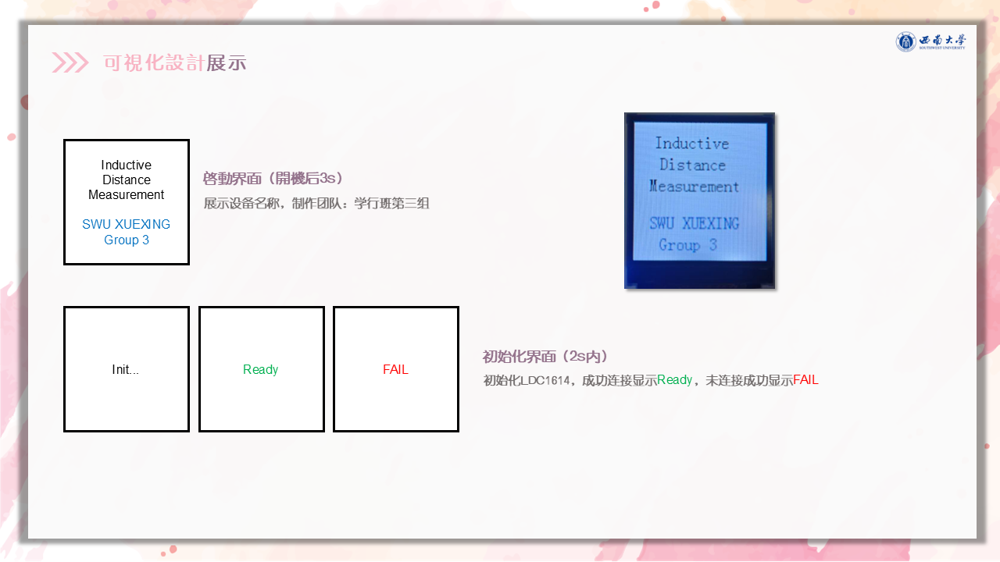

# 基于 LDC1614 的电感式工件合格性检测装置

[English](./README.md) · [演示视频](./media/demonstration.mp4) · [项目汇报](./presentation/project-presentation.pptx) · [项目方案](./docs/project-proposal.docx)

一套基于 STM32 的非接触式电感检测原型，用于判断金属工件的位置、装配或紧固状态是否落在合格区间。

## 项目基本信息

| 项目 | 内容 |
|---|---|
| 项目时间 | **2025 年 11 月—2025 年 12 月** |
| 课程 | 电子电路课程项目 |
| 项目组长 | **胡荣杰** |
| 实际开发者 | **胡荣杰——唯一实际设计与开发者** |
| 汇报材料中的名义小组 | 胡荣杰、唐丽莎、张润涵、石周鹭、董佳慧 |
| 贡献说明 | 除胡荣杰外，其余姓名仅出现在课程汇报的成员名单中；电路与系统方案、固件、外壳集成、测试调试及项目文档均由 **胡荣杰一人完成**。 |
| 项目类型 | 嵌入式硬件原型 + 固件 + 3D 打印外壳 |
| 原型成本 | **现有资料未记录，待后续补充** |

## 商业化与应用分析

本项目面向人工目检与高成本机器视觉检测站之间的细分需求。电感探头不依赖环境光，并能在灰尘、油污等场景中检测金属目标，可用于金属件有无、插入深度、螺母紧固位置和夹具定位等判断。

潜在用户包括小型装配车间、教学实验室、工装夹具制造商和小批量生产线。若要产品化，还需增加刚性机械基准、可更换探头夹具、可追溯标定、质量数据记录、EMC 验证以及工业级电源与接口。更合理的商业定位是低成本、专任务检测工装，而非通用精密位移仪。

## 实现原理

检测线圈与电容构成 LC 谐振回路。导电目标靠近后产生涡流，使线圈的等效电感和损耗发生变化；**LDC1614** 将变化转换为高分辨率数字量，**STM32F103RC** 完成滤波、相对位置映射、合格判定和 LCD 显示。

实体原型由购买的电子/机械模块与自制 **3D 打印外壳**组合而成，外壳集成显示区、测试平台、操作按键和内部存放空间。

### 标定与判定逻辑

1. 记录空载基准；
2. 放置合格参考件并记录第二标定点；
3. 将实时读数映射到 `0–100%` 相对量程；
4. `45–55%` 判为 **PASS**，高于 `55%` 判为 **FAR**，低于 `45%` 判为 **NEAR**。

源码已确认采用上述两点标定与合格区间。早期方案文档曾写 LDC1314，最终硬件和固件实际使用的是 **LDC1614**。

## 设计指标

以下是终期汇报中记录的设计目标，不等同于计量认证结果：

| 指标 | 目标 |
|---|---:|
| 显示刷新 | ≤ 300 ms |
| 相对分辨率 | ≤ 1% |
| 静态波动 | ≤ ±2% |
| 重复误差 | ≤ ±3% |
| 标定流程 | ≤ 5 个操作步骤 |

## 仓库内容

- `USER/`、`HARDWARE/`：STM32 应用与外设驱动
- `assets/`：从终期 PPT 导出的 README 配图
- `docs/project-proposal.docx`：原始项目方案
- `presentation/project-presentation.pptx`：原始终期汇报
- `media/demonstration.mp4`：实体原型演示
- `OBJ/`：历史代码仓库中保留的构建产物

## 编译与使用

1. 使用 Keil MDK 打开 `USER/` 下的工程文件；
2. 按仓库已有配置编译 STM32F10x 标准外设库工程；
3. 使用 ST-Link 烧录 STM32F103RC；
4. 上电后依次完成空载与合格参考件标定，再放置待测件。

## 当前限制

- 输出是相对两点标定值，并非毫米级绝对距离；
- 夹具刚度、目标材质和形状、温度与线圈对中均会影响读数；
- 尚未实现长期标定追溯、生产统计或工业 I/O；
- 现有资料没有可核验的物料清单与成本记录。

## 协议

项目原创文档、汇报、图片、视频和硬件设计资料采用 **CC BY-NC-SA 4.0**；详见 [LICENSE-CONTENT.md](./LICENSE-CONTENT.md)。源码及第三方厂商组件仍遵循各自文件中注明的许可条款。

